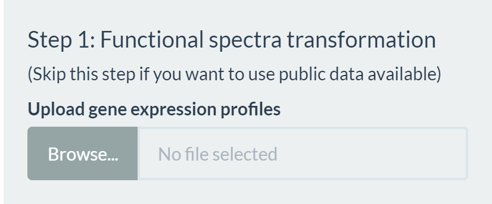
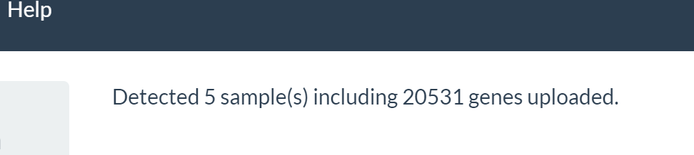
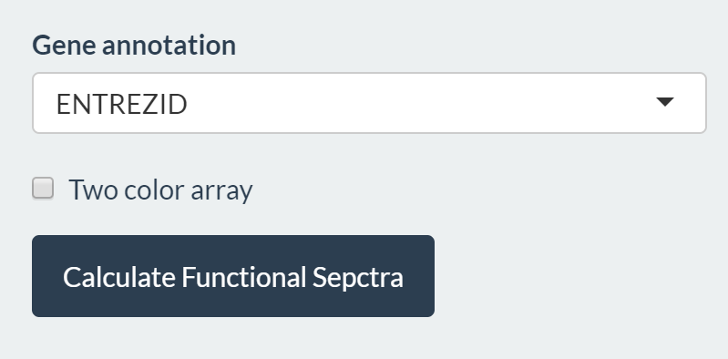
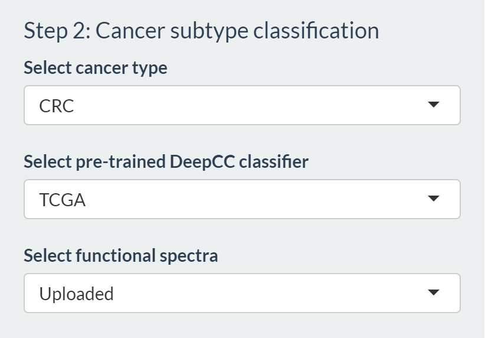
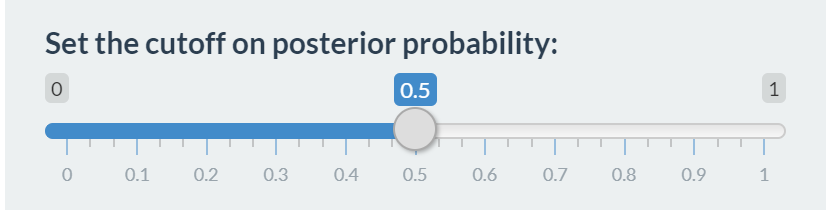
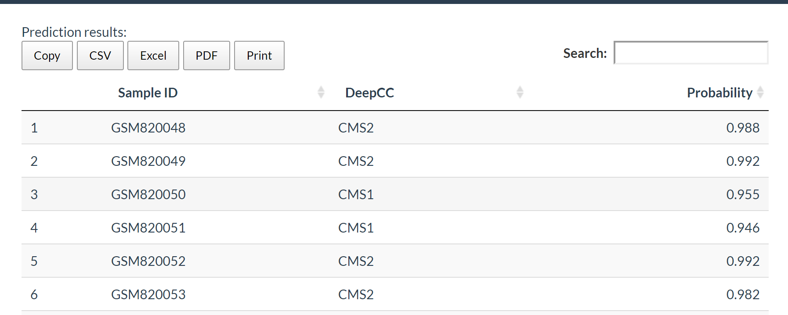

### A step-by-step guide to use DeepCC Online

   

#### Step 1. Covert uploaded gene expression data to functional spectra  
(*Skip this step if you want to use public data available)

##### (1) Upload your gene expression data. Please click the Browse button and chose your local file containing gene expression profiles (in csv format), where columns are samples and rows are genes.
  
   

   

##### (2) After uploading, check the status of data uploading/processing.

   

  

##### (3) Specify gene annotation, gene set database (currently only MSigDBv6 is provided), and whether the platform is two-color microarray

   

  

##### (4) Click ‘Calculate Functional Spectra’ button to transform uploaded gene expression data to functional spectra. You can also check the status to confirm.

 
#### Step 2. Prediction using uploaded data  

##### (1) Select the specific cancer type.  

##### (2) Select which pretrained classifier to use.  

##### (3) Select functional Spectra calculated from ‘uploaded’ data or preprocessed public data sets.

   

  

##### (4) Specify the cutoff on posterior probability.  

   

  

##### (5) Click ‘Predict Cancer Subtype’ for classification  

The predicted results will appear on the right side of the page, and can be downloaded in various formats (csv, excel, pdf). 

   

  

